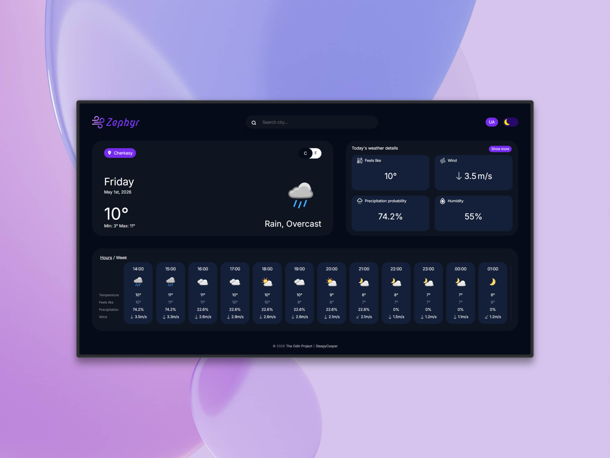
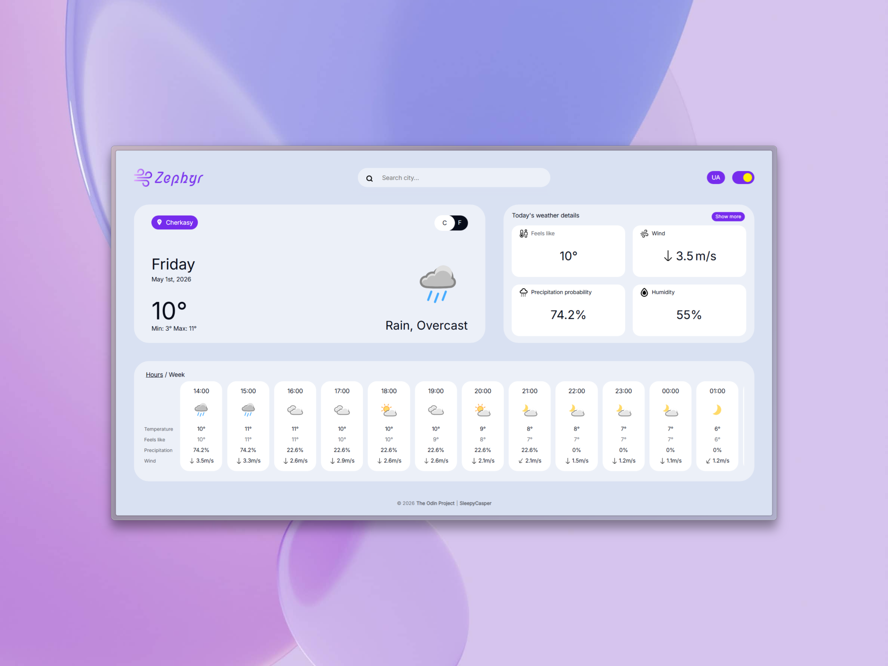
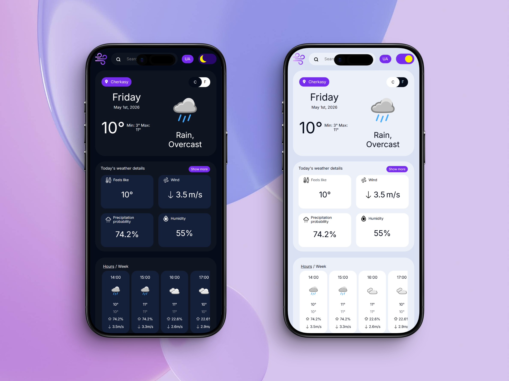

# Zephyr

A weather application that provides real-time weather information with a clean, intuitive interface.

## Preview
### [Live demo](https://sleepycasper.github.io/odin-weather-app/)





## Features

- **Real-time Weather Data** - Get current weather conditions for any location
- **Dual-language Support** - Available in English and Ukrainian languages
- **Responsive Design** - Works seamlessly on desktop and mobile devices
- **Search Functionality** - Easily search for cities and locations
- **Temperature Units** - Toggle between Celsius and Fahrenheit

## Key challenges
- **API integration** - Learning how to handle asynchronous data fetching with ```async/await``` and ```fetch``` API
- **Responsive design** - Styling a website to be usable on tablet and mobile devices
- **Internationalization** - Implementing a dual-language support, creating a centralized translation system to keep the UI logic clean.

## Getting Started

### Prerequisites

- Node.js (v14 or higher)
- npm or yarn

### Installation

1. Clone the repository:
```bash
git clone <repository-url>
```

2. Install dependencies:
```bash
npm install
```

### Development

Run the development server with hot reload:
```bash
npm start
```

The app will be available at `http://localhost:8080`

### Production Build

Create optimized production build:
```bash
npm run build
```

Deploy to GitHub Pages:
```bash
npm run deploy
```

## Project Structure

```
├── src/
│   ├── elements.js      # DOM element creators
│   ├── eventHandler.js  # Event handling logic
│   ├── init.js          # Application initialization
│   ├── parser.js        # Data parsing utilities
│   ├── render.js        # Rendering functions
│   ├── store.js         # State management
│   ├── translation.js   # Internationalization
│   ├── utils.js         # Utility functions
│   ├── condition-icons.js # Weather icons
│   ├── template.html    # HTML template
│   ├── fonts/           # Custom fonts
│   └── styles/          # CSS styles
├── dist/                # Production build output
├── webpack.common.js    # Shared webpack config
├── webpack.dev.js       # Development webpack config
├── webpack.prod.js      # Production webpack config
└── package.json         # Project dependencies
```

## Available Scripts

| Command | Description |
|---------|-------------|
| `npm start` | Start development server |
| `npm run build` | Create production build |
| `npm run deploy` | Deploy to GitHub Pages |
| `npm run lint` | Run ESLint |

## Built With

### Core Technologies
- HTML
- JavaScript ES6
- CSS

### Third-Party Libraries
- [autocomplete.js](https://github.com/algolia/autocomplete.js) - Autocomplete search library
- [date-fns](https://date-fns.org/) - Modern date utility library
- [dragscroll](https://github.com/asvd/dragscroll) - Drag to scroll functionality

### APIs
- [VisualCrossing](https://www.visualcrossing.com/) - Weather data and forecasts
- [Geoapify](https://www.geoapify.com/) - Location search and geocoding

### Development Tools
- [Webpack](/create-readme) - a module bundler for JavaScript
- [ESLint](https://eslint.org/) - JavaScript linting
- [Prettier](https://prettier.io/) - Code formatter
- [gh-pages](https://github.com/tschaub/gh-pages) - GitHub Pages deployment
- [HTML Webpack Plugin](https://github.com/jantimon/html-webpack-plugin) - HTML template processing
- [CSS Loader](https://github.com/webpack-contrib/css-loader) - CSS module support
- [Mini CSS Extract Plugin](https://github.com/webpack-contrib/mini-css-extract-plugin) - CSS extraction for production

## License

[ISC License](./LICENSE)

## Credits

### Design

Color palette and layout of the website take reference from [Puja Kumari](https://www.figma.com/@efb44a4c_df9d_4)

### Icons

- Weather icons by [Amedia Utvikling](https://github.com/amedia)

- Logo icon by [Freepik](https://www.flaticon.com/authors/freepik)

---
Created as a part of [**The Odin Project**](https://www.theodinproject.com/) curriculum 

